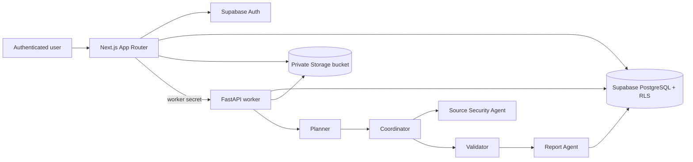

# AegisFlow architecture

The web server handles user/session boundaries and never sends privileged credentials to the browser. The worker owns source extraction, analysis, and report persistence. All user-facing data is read back through ownership-filtered Supabase queries.
